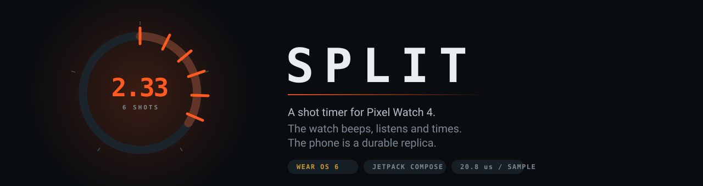
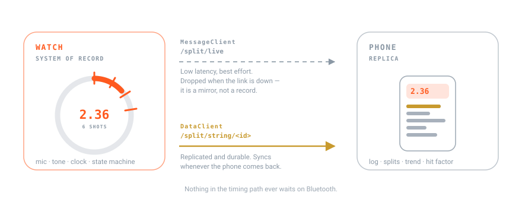

<div align="center">



[](https://github.com/GPTmadeit/split-shot-timer/actions/workflows/ci.yml)
[](https://github.com/GPTmadeit/split-shot-timer/actions/workflows/security.yml)
[](https://github.com/GPTmadeit/split-shot-timer/releases)
[](LICENSE)
[](#status-and-honest-limitations)
[](#status-and-honest-limitations)

**[▶ Try it in your browser](https://gptmadeit.github.io/split-shot-timer/)** · no install, works on a phone

</div>

---

## What this is

A **shot timer** for the Pixel Watch 4 and a companion phone app.

A shot timer is the basic instrument of practical shooting. It beeps to start you, listens for
your gunshots, and reports how long each one took — your *draw* (time to the first shot) and
your *splits* (time between consecutive shots). Competitive shooters live by these numbers.

Dedicated timers cost $110–190, are one more thing to carry, and sit clipped to your belt where
you cannot see them. **SPLIT puts the timer on your wrist**, and adds one thing no dedicated
timer can do: it cross-checks each bang against a recoil impulse from the watch's accelerometer,
so the shooter in the next bay does not end up in your string.

The watch is the instrument and the system of record. The phone is a durable replica for review
and analysis. Neither depends on the other to function.

<a id="why-it-works-at-all"></a>

## Why a watch microphone can do this at all

This is the question that decides whether the project is possible, so it is worth stating plainly.

A 9mm at the shooter's ear runs **160–165 dB SPL**.<sup>[1](#references)</sup> The MEMS capsule
in a watch clips at roughly **120–130 dB**.<sup>[2](#references)</sup> Every shot overdrives the
microphone by 30–45 dB, so the amplitude coming off the converter is meaningless — it is simply
*railed*.

That does not matter, because **a shot timer does not need a level, it needs an arrival time.**

Better still, the saturation is itself the most useful signal available. Your own muzzle rails
the converter for milliseconds; a shooter two bays over arrives around 30 dB down and never rails
at all. Gating on *how long the signal stayed railed* rejects neighbours in a way that a plain
loudness threshold cannot.

## Features

| | |
| --- | --- |
| **Sample-accurate timing** | Onset resolution of one sample — 20.8 µs at 48 kHz — rather than one audio buffer (~10 ms). |
| **True start instant** | The clock starts when the tone physically leaves the speaker, not when a thread woke up. |
| **AGC defeated** | Pins the rawest microphone source the device exposes, so gain does not duck after the first round. |
| **Neighbour rejection** | Clip-run gating, plus an optional accelerometer recoil gate. |
| **Nine drills** | Bill, Failure to Stop, F.A.S.T., 1‑Reload‑1, Blake, El Presidente, Casino, Dot Torture, Freestyle. |
| **Enforced standards** | Shot count and par are enforced; the string auto-stops and grades itself. |
| **Split analysis** | Draw, every split, fastest, slowest, and split σ — the number that says whether you shot a cadence or got lucky once. |
| **USPSA hit factor** | Minor/major scoring with A/C/D/M/NS entry. |
| **Works out of range** | Completed strings are written on the watch first and sync to the phone whenever Bluetooth returns. |
| **Haptic start** | A wrist buzz cuts through hearing protection when a watch speaker does not. |
| **Auto-repeat** | Re-arms itself so you can run reps without touching the watch. |
| **In-app updates** | Both apps check this repository's releases and install a newer build, on request. |
| **Menu** | One button on each app opens Drill, Settings and Updates. |
| **Native to each platform** | Wear OS 6 structure on the watch (TimeText, EdgeButton, transforming lists); stock Android with Material You on the phone. |

## Requirements

**To use the browser prototype:** any modern browser. Microphone detection needs HTTPS, which
the hosted link provides.

**To build and install the apps:**

| | |
| --- | --- |
| JDK | 17 |
| Android SDK | Platform **36**, build-tools 36.0.0 |
| Watch | Wear OS 6 (API 36); `minSdk` is 30 |
| Phone | Android 10+ (`minSdk` 29) |
| Gradle | Wrapper included — do not install Gradle separately |

> **Note on `compileSdk`:** this project pins `compileSdk 36` and holds several dependencies
> back to match. Platform 37 is not published in the SDK manager yet. See
> [Version pinning](#version-pinning--read-before-upgrading).

## Quick start

### The fastest path — no install

Open **<https://gptmadeit.github.io/split-shot-timer/>** on your phone. Tap the face (or press
space on a desktop) to log shots by hand, or grant microphone access to detect live fire. Add it
to your home screen and it runs full-screen.

### Install the apps

Download the APKs from the [latest release](https://github.com/GPTmadeit/split-shot-timer/releases/latest):

```bash
adb -s <watch-serial> install -r split-wear-<version>-debug.apk
```

```bash
adb -s <phone-serial> install -r split-mobile-<version>-debug.apk
```

Run `adb devices` to list serials. The two apps share an `applicationId`, so **install the watch
APK on the watch and the phone APK on the phone** — putting both on one device replaces one with
the other.

> [!IMPORTANT]
> **Coming from v0.1.0 or v0.2.0? Uninstall first.** Those releases were each signed with a
> different throwaway key, so Android rejects the upgrade with
> `INSTALL_FAILED_UPDATE_INCOMPATIBLE`. From v0.2.1 onward every build shares one committed
> signing key, so updates install in place normally. This is a one-time break.

### Updating

**From v0.3.0 onward you do not need a computer.** Open the menu (the three-dot button — top of
the face on the watch, top-right on the phone), choose **Updates**, then **Check**. If a newer
release exists you can download and install it from the device. Android shows its own
confirmation prompt; nothing installs silently, and the app never checks on its own — only when
you press Check.

Each app updates itself: the watch fetches the watch APK, the phone fetches the phone APK.

By `adb` if you prefer — settings and logged strings are kept either way:

```bash
adb install -r split-wear-<newer-version>-debug.apk
```

The release APKs are **debug-signed** with a key committed to this repository. That makes updates
work, but it is not an authenticity guarantee — anyone can sign an APK with it. Verify downloads
against the `SHA256SUMS.txt` published with each release.

### Build from source

```bash
git clone https://github.com/GPTmadeit/split-shot-timer.git
```

```bash
cd split-shot-timer && ./gradlew :wear:assembleDebug :mobile:assembleDebug
```

APKs land in `wear/build/outputs/apk/debug/` and `mobile/build/outputs/apk/debug/`.

## Usage

### Your first string

1. Open **SPLIT** on the watch and grant microphone access. It must be granted while the app is
   open — that is an Android rule for microphone foreground services, not a choice made here.
2. Tap the drill name at the top to pick a drill, or open the **menu** (three dots) for Drill,
   Settings and Updates. Start with **Freestyle** (no shot cap, no par).
3. Press **START**. The bezel fills brass and counts down a random 1–4 second delay so you
   cannot anticipate the beep.
4. On the tone, shoot. Each detected shot burns an orange tick into the bezel and updates the
   readout.
5. The string ends when you press **STOP**, or automatically on the last shot of a drill with a
   fixed count.

### Reading the face

The bezel is a time tape. The acoustic envelope draws inward from the band; each shot burns a
tick outward at its angular position in the string. **By the end of a run the ring is the
string** — you read your cadence at a glance without parsing digits, which matters when your
eyes belong on the target.

Under the clock: `DRAW` (time to first shot), `SPLIT` (live time since the last shot), and
`SHOTS` (count, or count/target on a fixed drill).

### Calibrating — do this before your first live string

Open the menu (three dots) → **Settings** and watch the level meter while the range is active around you.

1. Turn **sensitivity** down until ambient range noise stops lighting the meter past the brass
   marker.
2. Leave **clip gate** on. It requires the converter to actually rail, which is what rejects
   the bay next to you.
3. Lower **echo blanking** if you shoot splits faster than the current dead time. Indoor ranges
   need more blanking; outdoors you can go lower.

### On the phone

Completed strings appear automatically. Tap a string to expand it for split bars and USPSA
scoring. A rosette badge marks your best draw of the session, and the trend chart tracks draw
time across strings.

If the watch is in range while you shoot, the phone mirrors the running string live. If it is
not, nothing is lost — the strings arrive when the link returns.

## Configuration

All settings live on the watch: menu (three dots) → **Settings**.

| Setting | Default | What it does |
| --- | --- | --- |
| Sensitivity | −22 dBFS | Onset threshold. Lower = less sensitive. |
| Clip gate | On | Require the converter to rail. Rejects distant gunfire. |
| Recoil gate | **Off** | Require a matching wrist impulse. See the warning below. |
| Echo blanking | 60 ms | Dead time after each shot, to reject reverb. |
| Start delay | Random 1–4 s | Also: instant, random 2–5 s, fixed 3 s. |
| Start signal | Beep + haptic | Haptic-only is useful in muffs. |
| Par tone | On | Second tone at the drill's par time. |
| Auto-repeat | Off | Re-arm automatically after 5/8/12 s. |

> [!WARNING]
> **The recoil gate ships off, deliberately.** Recoil transfer depends on grip and on which
> wrist wears the watch. Support hand on a two-handed grip reads cleanly; strong hand reads
> harder; a one-handed string on the off hand may read nothing at all. Rimfire and heavily
> buffered PCCs may fall under the threshold entirely. Turn it on only after you have verified
> it against your own gun.

## Troubleshooting

**Shots are being missed.**
Raise sensitivity (a less negative dB value). If you shoot suppressed, turn the **clip gate
off** — a suppressed host can sit below the microphone's clipping point, so there is no rail
to detect.

**More shots recorded than fired.**
Indoor reverb is being counted as extra shots. Raise echo blanking to 90 or 130 ms. If the very
first "shot" is spurious, the start tone is leaking in — file an issue, that is a bug.

**The neighbouring bay is registering.**
Turn the clip gate on, and lower sensitivity. If it persists and you shoot two-handed with the
watch on your support wrist, try the recoil gate.

**Nothing is detected at all.**
Check Settings shows a source and sample rate (e.g. `UNPROCESSED @ 48000 Hz`). If it says the
mic is off, the permission was denied — reopen the app and grant it.

**Strings are not reaching the phone.**
Both apps must be installed and the watch paired. Strings are held on the watch and sync when
the link returns, so give it a moment after you are back in range. Nothing is lost in the
meantime.

**The browser page renders tiny, or the ring is blank.**
Reload it. If it persists, open an issue with your browser and OS.

**"Check failed" on the Updates screen.**
"No internet connection" means the device has no route out — a watch on Bluetooth-only may have
none of its own. "GitHub rate limit reached" resolves itself in an hour; unauthenticated API
calls are limited per IP. You can always update by `adb` instead.

**Android blocks the install after downloading.**
Sideloaded installs need "install unknown apps" allowed for SPLIT. Android prompts for this the
first time; if you declined, re-enable it in system settings for this app.

**`INSTALL_FAILED_UPDATE_INCOMPATIBLE` when installing.**
You have v0.1.0 or v0.2.0 installed, which used a different signing key. Uninstall the old
version first — `adb uninstall com.carlb.split` — then install again. Updates from v0.2.1 onward
work in place.

**The watch app opens and immediately closes.**
That was a real bug in v0.1.0 and v0.2.0: an undeclared sensor permission crashed the foreground
service, and the service kept restarting into the same crash. Fixed in v0.2.1. If you see it on
v0.2.1 or later, please file a bug with `adb logcat -d -s AndroidRuntime:E`.

**Gradle fails with "requires Android Gradle plugin 9.x" or "compile against version 37".**
A dependency has been bumped past what this project pins. See
[Version pinning](#version-pinning--read-before-upgrading).

## FAQ

**Does this work on other Wear OS watches?**
It should build and run on any Wear OS 5+ device with a microphone (`minSdk 30`), but it has
only ever been reasoned about for the Pixel Watch 4 and has not been run on any hardware at all.

**Do I need the phone app?**
No. The watch app is standalone and declares itself as such. The phone app adds review,
trend analysis and hit factor scoring.

**Is it as accurate as a CED7000 or PACT timer?**
Unknown, and anyone claiming otherwise without measurements is guessing. The *timing method*
here resolves to one audio sample, which is far finer than the 0.01 s these timers display. But
resolution is not accuracy: end-to-end accuracy depends on hardware latencies that have not been
measured. Treat it as unverified until it is characterised.

**Why does it need microphone permission all the time?**
It does not. The microphone foreground service can only be started while the app is open, and
it stops when you leave. There is no background listening.

**Does it record or upload audio?**
No. Audio is analysed sample-by-sample in memory and discarded, and nothing is written to disk.

**So what is the network permission for?**
Only the update check, added in v0.3.0, and only when you press Check. It is an unauthenticated
request to this repository's public release list — nothing about you, your settings or your
shooting is ever sent. There is no background poller and no telemetry. Full detail in
[SECURITY.md](SECURITY.md).

**Can it install an update without asking me?**
No. The app downloads the APK and hands it to Android's package installer, which shows the
system's own confirmation. `REQUEST_INSTALL_PACKAGES` lets an app ask; it never lets one install
unattended.

**Why is the release a pre-release?**
Because nothing has been tested on hardware. See [Status](#status-and-honest-limitations).

**Can I use this in a match?**
No. Use a certified timer. This is a practice tool.

## Architecture



Three modules:

```
core/     models, wire contract, update logic  (pure Kotlin, 60 unit tests)
wear/     the instrument: mic, tone, clock, state machine
mobile/   the replica: receiver, log, analysis
docs/     browser prototype and diagrams
```

Two transports, deliberately different, because at a range your phone is in a bag on the bench
and Bluetooth drops constantly:

- **`MessageClient` → `/split/live`** — low latency, best effort, silently dropped when the link
  is down. Mirrors a running string. Nothing the timer needs travels here.
- **`DataClient` → `/split/string/<id>`** — replicated and durable. Survives the phone being out
  of range for an entire session.

Full detail, including the timing method and the reasoning behind each detector constant, is in
[ARCHITECTURE.md](ARCHITECTURE.md).

## Development

```bash
./gradlew build
```

That compiles both apps for debug and release, runs the unit tests, and runs Android Lint.

| Task | Command |
| --- | --- |
| Unit tests | `./gradlew testDebugUnitTest` |
| Android Lint | `./gradlew lintDebug` |
| Assemble APKs | `./gradlew :wear:assembleDebug :mobile:assembleDebug` |
| Kotlin formatting | see [CONTRIBUTING.md](CONTRIBUTING.md#formatting) |

Reports land in `*/build/reports/`.

### Version pinning — read before upgrading

Versions in [`gradle/libs.versions.toml`](gradle/libs.versions.toml) are **not** "latest". They
are the newest stable releases whose AAR metadata still permits `compileSdk 36` / AGP 8.13.2.
Anything newer gates on `compileSdk 37`, which is not published in the SDK manager yet. These
were determined by reading `aar-metadata.properties` out of each artifact, not by guessing.

One deliberate exception: `material3` is pinned to **1.5.0-alpha18**. `MaterialExpressiveTheme`
and `MotionScheme` exist in 1.4.0 stable but are compiled `internal` there, so the Material 3
Expressive API is unreachable. alpha18 is the newest build that exposes it publicly *and* still
allows `compileSdk 36`.

Dependabot will open PRs that bump past these pins. Those PRs are expected to fail CI until
platform 37 ships — that failure is the intended signal, not a broken pipeline.

## Status and honest limitations

`./gradlew build` passes clean: both modules compile for debug and release, **60 unit tests**
pass, and Android Lint reports no issues on `:wear` or `:mobile`. Manifests are verified against
the packaged APKs. CI runs all of this on every push.

Both apps have also been **installed and launched on a Wear OS 6 (API 36) emulator**: the watch
app starts, holds its microphone foreground service, arms, plays the start tone and runs the
clock. CI repeats that install-and-launch check on every push, because every static check above
passed while the app was still crash-looping on launch.

> [!WARNING]
> **No live fire has ever been recorded through this code, and it has not run on a physical
> watch.** An emulator has no microphone worth the name and no gunshots.
> The four detector constants are reasoned starting points, not measurements:
>
> | Constant | Value | Basis |
> | --- | --- | --- |
> | Clip-run threshold | 3 samples | estimate |
> | Echo blanking | 60 ms | estimate |
> | Recoil window | ±40 ms | estimate |
> | Recoil threshold | 18 m/s² | estimate |
>
> Expect to characterise all four against your own firearm and range. If you do, please
> [tell us](https://github.com/GPTmadeit/split-shot-timer/issues/new?template=detection_accuracy.yml) —
> that is the single most valuable contribution this project can receive.

Other known limitations:

- The browser prototype cannot truly pin an unprocessed audio source. Browsers apply AGC and
  noise suppression by default and the page can only *request* they be disabled.
- There are no instrumented (on-device) tests. Unit tests cover `:core` logic only; the audio,
  sensor and UI layers are untested by machine.
- Release APKs are debug-signed. Play distribution requires your own signing key.

## Contributing

Contributions are welcome — especially real-world detection data. Start with
[CONTRIBUTING.md](CONTRIBUTING.md). By participating you agree to the
[Code of Conduct](CODE_OF_CONDUCT.md).

## Security

Please do not open public issues for vulnerabilities. See [SECURITY.md](SECURITY.md) for private
reporting. Both apps are offline by design: no network permission, no telemetry, no audio
retention.

## Support

Questions and setup help: [SUPPORT.md](SUPPORT.md).

## Licence

[MIT](LICENSE).

## References

1. Gunshot sound pressure levels at the shooter's position —
   [Wideners](https://www.wideners.com/blog/how-loud-is-a-gunshot/),
   [Silencer Shop](https://www.silencershop.com/blog/what-does-gunshot-sound-like).
2. MEMS microphone acoustic overload point —
   [Cirrus Logic AN0290](https://www.mouser.com/catalog/additional/Cirrus%20Logic_WAN0290_v1.0.pdf),
   [Infineon](https://community.infineon.com/t5/Knowledge-Base-Articles/MEMS-microphone-specifications/ta-p/696839).

<sub>Not affiliated with Google. Pixel and Wear OS are trademarks of Google LLC.</sub>
